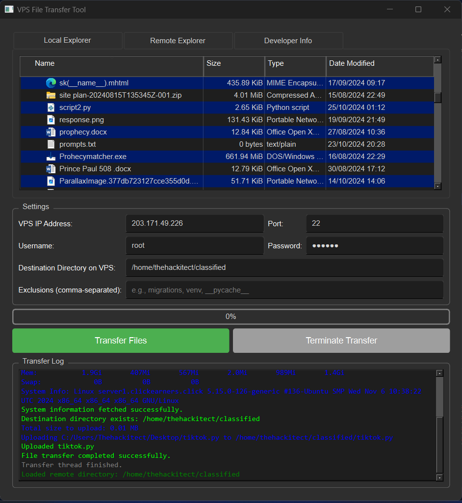

🚀 VPS File Transfer Tool
=========================

A robust and user-friendly PyQt6 application for seamless file transfers between your local machine and a Virtual Private Server (VPS).

✨ Features
----------

*   🔒 \*\*Secure Connections\*\*: Establish SSH and SFTP connections to your VPS with ease.
*   🗂️ \*\*Dual Explorer Views\*\*: Navigate through your local and remote file systems effortlessly using integrated explorers.
*   📁 \*\*Comprehensive File Management\*\*: Upload, download, delete, rename, create directories, and move files and folders.
*   🚫 \*\*Exclusion Support\*\*: Specify files or directories to exclude from transfers to streamline your workflow.
*   📊 \*\*Real-Time Progress Tracking\*\*: Monitor transfer progress with a dynamic progress bar and detailed logs.
*   ⏹️ \*\*Graceful Termination\*\*: Safely terminate ongoing transfers without corrupting data.
*   🌐 \*\*Developer Info & Links\*\*: Access developer profiles and contact information directly from the application.

🛠️ Installation
----------------

### 🔍 Prerequisites

*   💻 \*\*Python 3.7+\*\*: Ensure Python is installed on your system. \[Download Python\](https://www.python.org/downloads/)
*   📦 \*\*pip\*\*: Python package installer. Typically included with Python.

### 📥 Clone the Repository

    git clone https://github.com/yourusername/VPS-File-Transfer-Tool.git

### 📂 Navigate to the Project Directory

    cd VPS-File-Transfer-Tool

### 📦 Install Dependencies

    pip install -r requirements.txt

🚀 Usage
--------

1.  🔓 \*\*Launch the Application\*\*:
    
        python src/main.py
    
2.  🖥️ \*\*Configure VPS Credentials\*\*:
    *   Enter your VPS IP address, port, username, and password.
    *   Specify the destination directory on your VPS.
    *   Optionally, list any files or directories to exclude from transfers.
3.  📁 \*\*Select Files/Folders\*\*:
    *   Use the Local Explorer to navigate and select files or directories you wish to transfer.
4.  ➡️ \*\*Initiate Transfer\*\*:
    *   Click the "Transfer Files" button to start uploading selected items to your VPS.
    *   Monitor the progress through the progress bar and logs.
5.  🔄 \*\*Manage Remote Files\*\*:
    *   Use the Remote Explorer's context menu to download, delete, rename, create directories, or move files on your VPS.

💻 Compiling to a Standalone Executable
---------------------------------------

To distribute your application as a standalone executable, you can use [PyInstaller](https://www.pyinstaller.org/). This tool packages your Python application and all its dependencies into a single executable file.

### 📥 Install PyInstaller

    pip install pyinstaller

### 🛠️ Prepare Your Application

*   Ensure all resource files (icons, images) are correctly referenced in your code.
*   Place all resources in the \`resources/\` directory.

### 📦 Create the Executable

    pyinstaller --onefile --windowed --add-data "resources/icons/app_icon.png;resources/icons" --add-data "resources/images/intro_image.png;resources/images" src/main.py

**Options Explained:**

*   `--onefile`: Creates a single executable file.
*   `--windowed`: Prevents a console window from appearing (suitable for GUI applications).
*   `--add-data`: Includes additional non-Python files (e.g., images, icons). The syntax is `source;destination` on Windows and `source:destination` on macOS/Linux.

After running the above command, the executable will be located in the `dist/` directory.

📜 License
----------

This project is licensed under the [MIT License](LICENSE).

🤝 Contributing
---------------

Contributions are welcome! Please follow these steps:

1.  🔀 Fork the repository.
2.  ✏️ Create a new branch for your feature or bugfix.
3.  💾 Commit your changes with clear messages.
4.  🔄 Push your branch to your fork.
5.  📝 Open a Pull Request detailing your changes.

For major changes, please open an issue first to discuss what you would like to change.

📫 Contact
----------

For any inquiries or support, please contact [thehackitect.bots@gmail.com](mailto:thehackitect.bots@gmail.com).

🌟 Developer Info
-----------------

 

© \[Year\] thehackitect. All rights reserved.